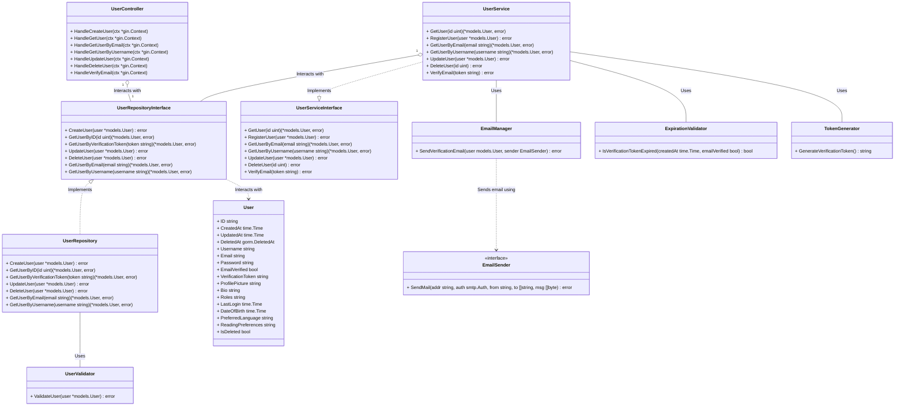

# Class Diagram

```mermaid
classDiagram

UserController "1" o-- "1" UserRepositoryInterface: Interacts with

UserService ..|> UserServiceInterface: Implements
UserService "1" o-- "1" UserRepositoryInterface: Interacts with
UserService -- EmailManager: Uses
UserService -- ExpirationValidator: Uses
UserService -- TokenGenerator: Uses

UserRepository -- UserValidator: Uses
UserRepositoryInterface ..> User: Interacts with
UserRepositoryInterface <|.. UserRepository: Implements

EmailManager ..> EmailSender: Sends email using

class UserController {
    + HandleCreateUser(ctx *gin.Context)
    + HandleGetUser(ctx *gin.Context)
    + HandleGetUserByEmail(ctx *gin.Context)
    + HandleGetUserByUsername(ctx *gin.Context)
    + HandleUpdateUser(ctx *gin.Context)
    + HandleDeleteUser(ctx *gin.Context)
    + HandleVerifyEmail(ctx *gin.Context)
}

class UserService {
    + GetUser(id uint) (*models.User, error)
    + RegisterUser(user *models.User) error
    + GetUserByEmail(email string) (*models.User, error)
    + GetUserByUsername(username string) (*models.User, error)
    + UpdateUser(user *models.User) error
    + DeleteUser(id uint) error
    + VerifyEmail(token string) error
}

class UserRepository {
    + CreateUser(user *models.User) error
    + GetUserByID(id uint) (*models.User, error)
    + GetUserByVerificationToken(token string) (*models.User, error)
    + UpdateUser(user *models.User) error
    + DeleteUser(user *models.User) error
    + GetUserByEmail(email string) (*models.User, error)
    + GetUserByUsername(username string) (*models.User, error)
}

class User {
    + ID    string
    + CreatedAt time.Time
    + UpdatedAt time.Time
    + DeletedAt gorm.DeletedAt
    + Username  string
    + Email string
    + Password string
    + EmailVerified bool
    + VerificationToken string
    + ProfilePicture string
    + Bio string
    + Roles string
    + LastLogin time.Time
    + DateOfBirth time.Time
    + PreferredLanguage string
    + ReadingPreferences string
    + IsDeleted bool
}

class EmailManager {
    + SendVerificationEmail(user models.User, sender EmailSender) error
}

class EmailSender {
    <<interface>>
    + SendMail(addr string, auth smtp.Auth, from string, to []string, msg []byte) error
}

class TokenGenerator {
    + GenerateVerificationToken() string
}

class UserValidator {
    + ValidateUser(user *models.User) error
}

class ExpirationValidator {
    + IsVerificationTokenExpired(createdAt time.Time, emailVerified bool) bool
}

class UserRepositoryInterface {
    + CreateUser(user *models.User) error
    + GetUserByID(id uint) (*models.User, error)
    + GetUserByVerificationToken(token string) (*models.User, error)
    + UpdateUser(user *models.User) error
    + DeleteUser(user *models.User) error
    + GetUserByEmail(email string) (*models.User, error)
    + GetUserByUsername(username string) (*models.User, error)
}

class UserServiceInterface {
    + GetUser(id uint) (*models.User, error)
    + RegisterUser(user *models.User) error
    + GetUserByEmail(email string) (*models.User, error)
    + GetUserByUsername(username string) (*models.User, error)
    + UpdateUser(user *models.User) error
    + DeleteUser(id uint) error
    + VerifyEmail(token string) error
}
```
